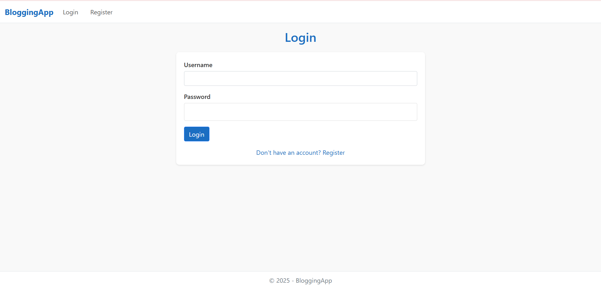
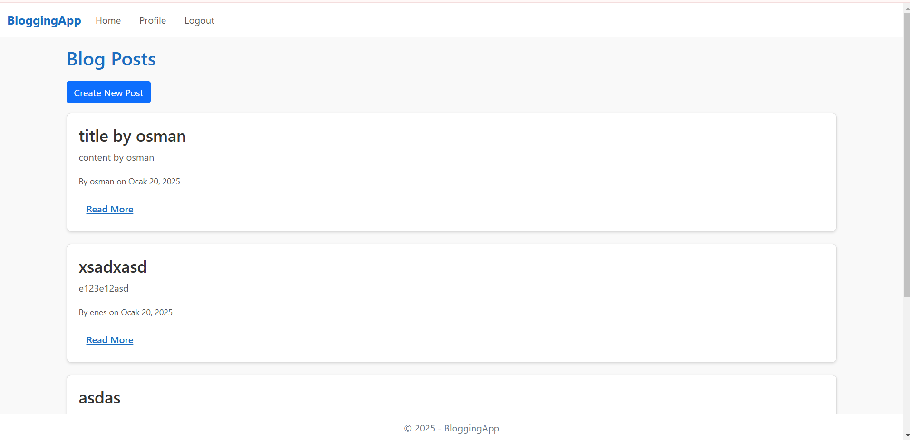
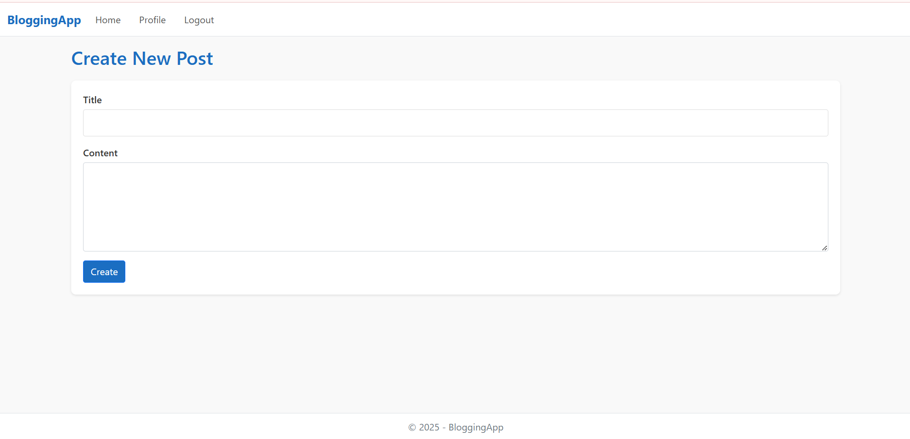
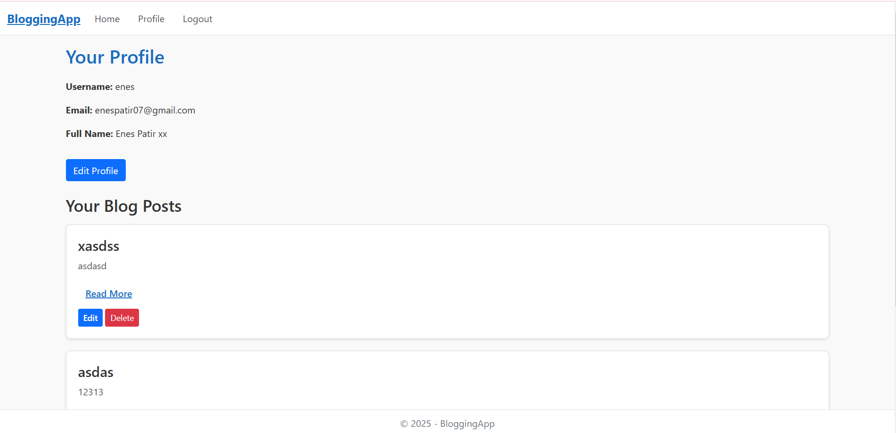
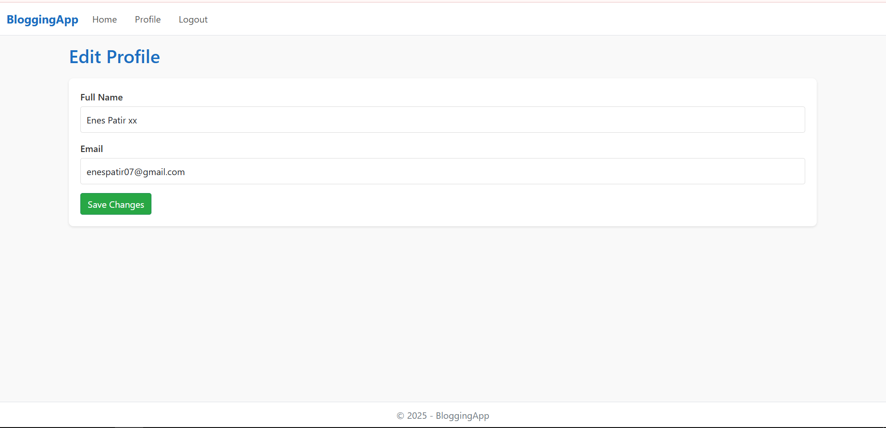

# BloggingApp

**BloggingApp** is a simple blogging platform built with **ASP.NET Core MVC** and **Entity Framework Core**. The application allows users to register, log in, create blog posts, edit their profiles, and manage their content in a user-friendly environment.

---

## Features

- **User Authentication**
  - Register and log in with username and password.
  - Session-based authentication for secure access.

- **User Profiles**
  - Edit user details such as name and email.
  - View all blog posts authored by the user.

- **Blog Management**
  - Create, read, update, and delete blog posts.
  - View blog posts by other users with details like author and creation date.

- **Responsive Design**
  - Minimal and simple design using Bootstrap and custom CSS.

---

## Tech Stack

- **Backend**: ASP.NET Core MVC, C#
- **Frontend**: Razor Views, Bootstrap, Custom CSS
- **Database**: MySQL (via Entity Framework Core)
- **Tools**: Visual Studio, Git

---

## Getting Started

### Prerequisites

- [Visual Studio](https://visualstudio.microsoft.com/) with ASP.NET and .NET Core workloads installed
- [.NET 6 SDK](https://dotnet.microsoft.com/download/dotnet/6.0)
- [MySQL Server](https://dev.mysql.com/downloads/)
- [Git](https://git-scm.com/)

### Installation

1. **Clone the Repository**
   ```bash
   git clone https://github.com/your-username/BloggingApp.git
   cd BloggingApp


Images From The App:<br>


<br>

<br>

<br>

<br>

